# canvas engineering launch thread

Quote-tweet of: https://x.com/fchollet/status/2072779641639875048
All images live in `paper/thread_assets/`. Regenerate with `python3 paper/make_thread_assets.py` (and `make_paper_figures.py` for the paper figures they copy).

<!-- WHY THIS STRUCTURE: post 1 hooks with the neurosymbolic framing + names the thing;
     2-3 explain the mechanism (the load-bearing claim is in 3); 4 grounds in a known
     baseline (diffusion policy) so readers can anchor; 5-6 are the compiler + pointability
     payoff (the most shareable material); 7 is receipts + honest limits; 8 links; 9 the
     confession. Front-load mechanism before results because this audience (fchollet QT
     readers) cares about the idea's shape more than the numbers. -->

---

## 1/

> these neurosymbolic architectures are so beautiful and promising bc they let you declare transparent symbolic macro-structure directly inside learnable neural mechanics. no discrete/continuous boundary to cross. but they need to move out of research and into prod if they're ever going to be more tempting than just paying for more data. so today im finally
>
> introducing canvas engineering: prompt engineering, but for reverse diffusion latent space dynamics
>
> 🧵

**images (4):**

| 1. paper first page | 2. rotating (T,H,W) volume |
|---|---|
| 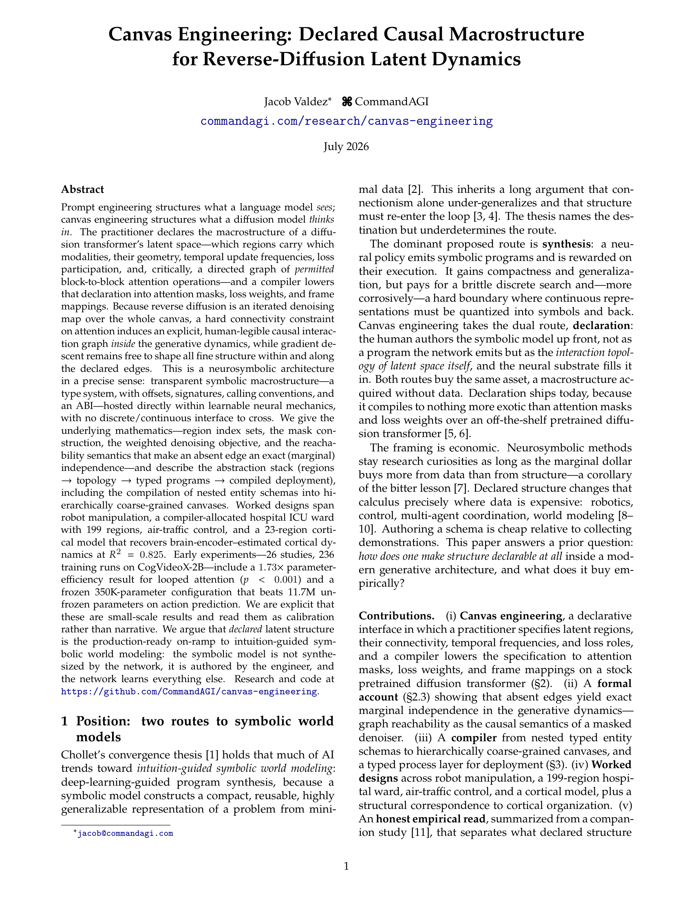 | 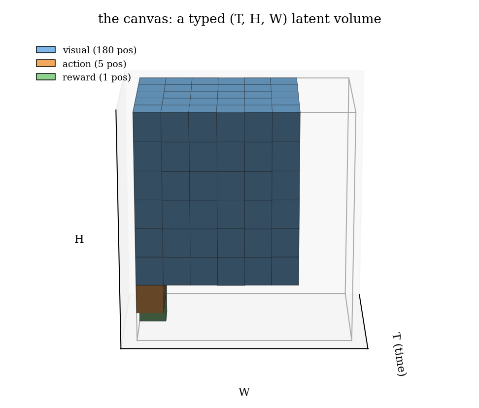 |
| **3. struct layout ↔ canvas schema** | **4. ICU compiler output (teaser for post 5)** |
| 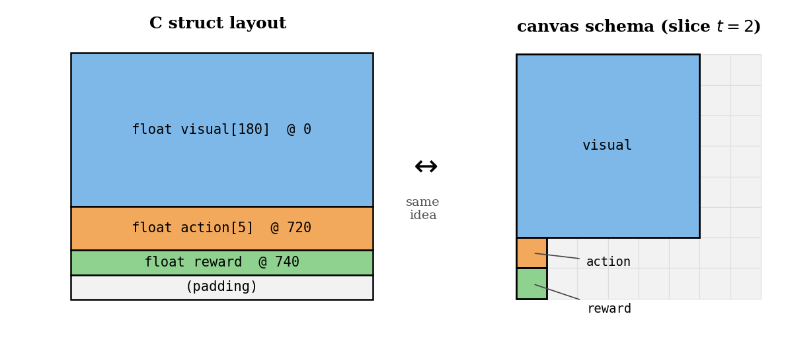 | 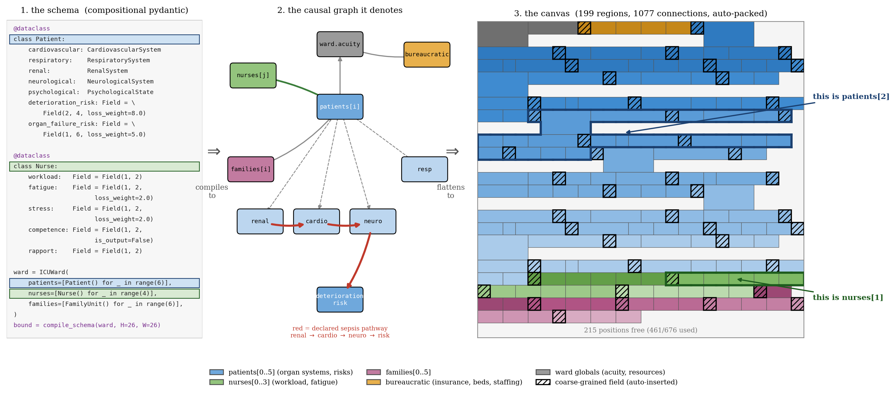 |

<!-- WHY: user asked for page1 + rotating gif here. Added type-system and ICU as slots
     3-4 because post 1 gets ~10x the impressions of any other post — put the two most
     "wait, what?" images where the most eyes are, even if they're explained later.
     The gif autoplays in timelines = scroll-stopper. -->
<!-- "no discrete/continuous boundary to cross" added vs the original draft — it's the
     sharpest differentiator from the program-synthesis route Chollet describes, and it
     makes the QT a *response* rather than an announcement. -->

---

## 2/

> here's how it works: you declare the latent block regions on the canvas, their connectivity, their temporal update frequencies, and their loss roles. a compiler lowers all of that into attention masks, loss weights, and frame mappings on a stock pretrained diffusion transformer
>
> but instead of uniform reverse diffusion over a flat bag of tokens, the connectivity you declared means only specific blocks are even *allowed* to influence each other (attention, not conv). that hard constraint induces a causal graph inside the reverse diffusion dynamics — an interaction graph you define explicitly

**images (4):**

| 1. declarations → compiled canvas + overlaid connection arrows | 2. the five time slices of the same layout |
|---|---|
| 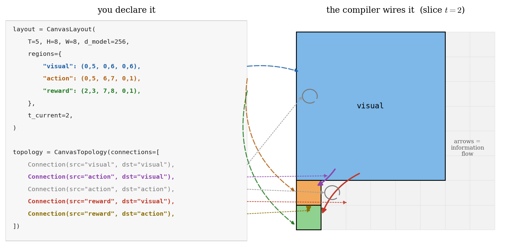 | 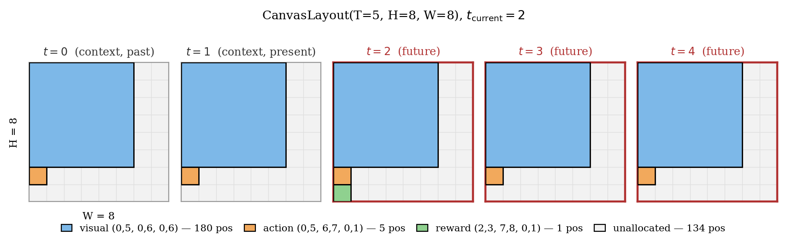 |
| **3. the topology compiled to an attention mask** | **4. the five topology constructors** |
| 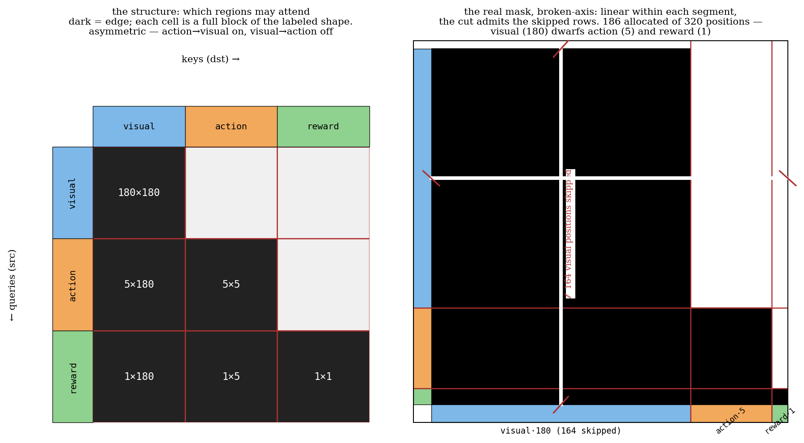 | 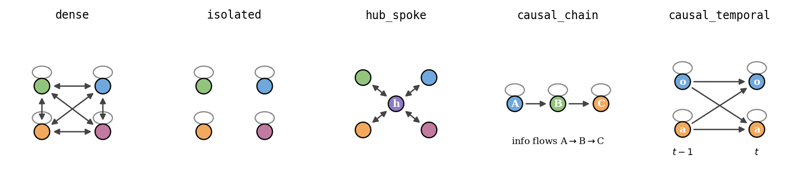 |

<!-- WHY: this is the "how it works" post so it carries the full pipeline in pictures:
     code -> canvas -> mask -> constructor vocabulary. code_to_canvas goes first because
     it fuses the declaration and the artifact in one image (user's request; it's also
     the clearest single explainer we have). -->
<!-- attention_mask is drawn at one-cell-per-region-frame (11x11), not the true 320x320 —
     the true mask is 97% visual-block and unreadable at timeline size. Caption inside
     the image says so ("one cell per region-frame"), so it's honest. Revisit if anyone
     reads it as the raw mask. -->

---

## 3/

> the split is clean: you fix *whether* an edge exists, its direction, its temporal extent. gradients (data or intrinsic losses) determine *what flows* along it and everything inside regions
>
> macro is symbolic. micro is neural. and there's no interface between them, because the symbolic layer literally IS the attention mask. if there's no path between two regions, their independence is exact — by construction, not regularization. it's d-separation compiled into a denoiser

**images (1):** the four core equations

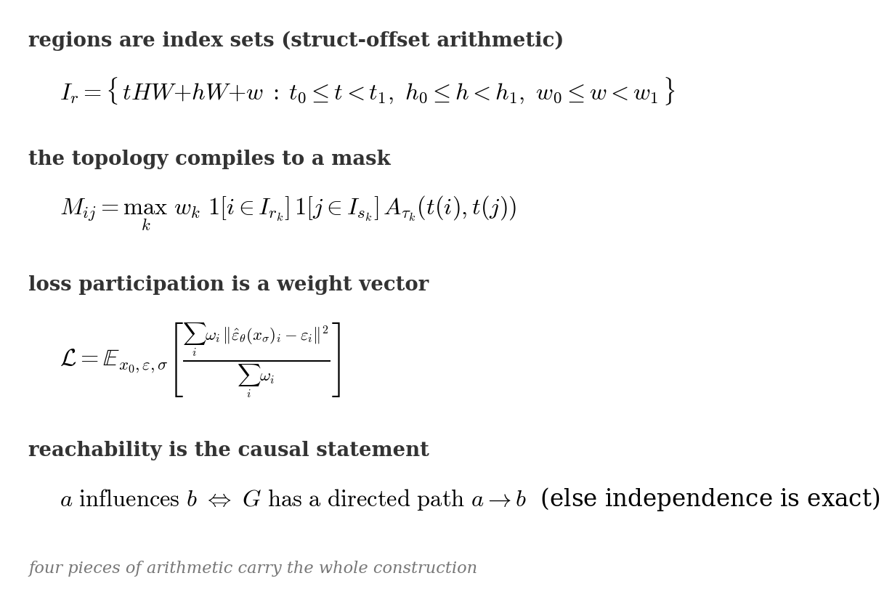

<!-- WHY only one image: this post is the thesis tweet, the one most likely to get
     screenshotted/quoted on its own. One austere math card underneath the boldest
     claim reads as "receipts attached"; a gallery here would dilute it. -->
<!-- "d-separation compiled into a denoiser" is the phrase to protect through edits —
     it compresses the whole paper for the ML-literate reader. -->

---

## 4/

> simplest possible example: diffusion policy. observation → action is just the two-node canvas. multi-agent perceptual diffusion — each agent self-attending over its own obs and actions, coordinating only through declared cross-edges — is the same primitive composed

**images (3):**

| 1. dense / isolated / hub_spoke / causal_chain / causal_temporal | 2. 64-vehicle cooperative trajectory prediction | 3. 12-aircraft conflict detection |
|---|---|---|
|  | 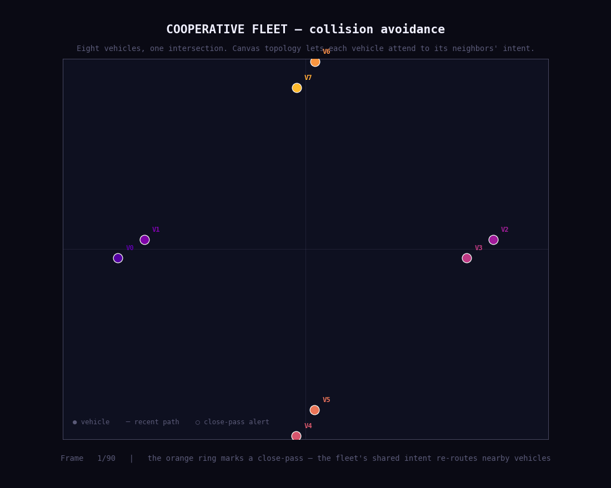 | 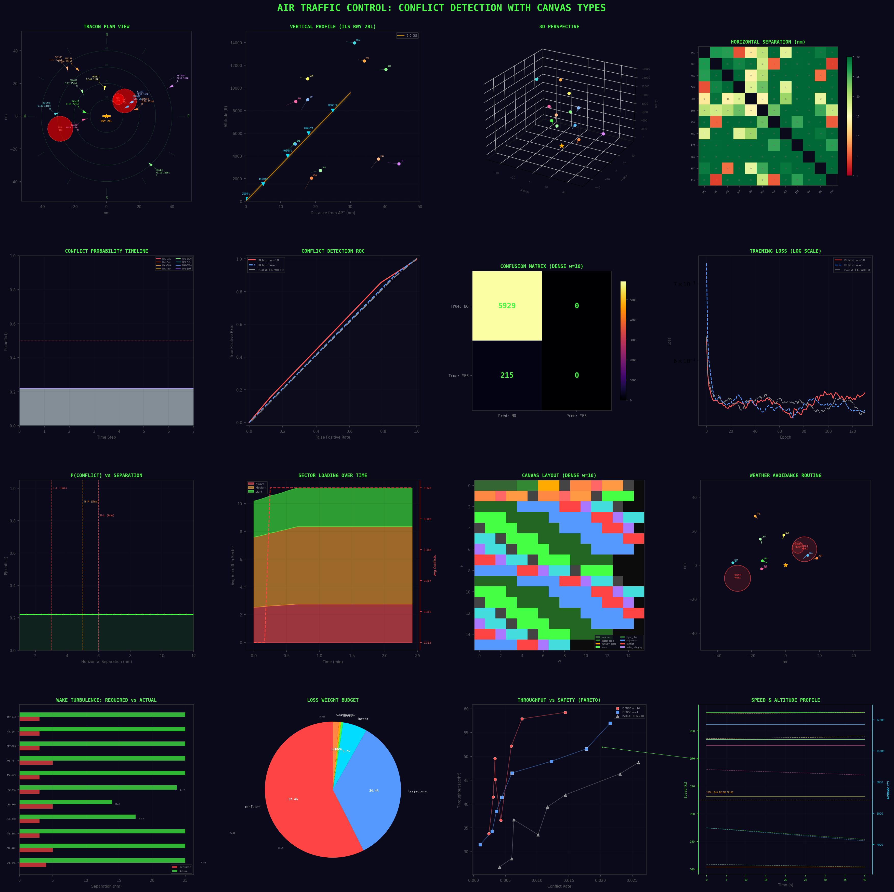 |

<!-- WHY: anchor-to-known-thing post. Diffusion policy is the reference point most of
     this audience already trusts; showing it as the degenerate 2-node case makes the
     general framework feel inevitable rather than exotic. Fleet gif + ATC show
     "composed" immediately. fig_topology repeats from post 2 intentionally — repetition
     across posts is fine on X since most readers see only one post out of context. -->

---

## 5/

> and you don't place rectangles by hand. you write the causal structure as a typed schema and the compiler flattens the graph it represents into the canvas
>
> this is a full hospital ICU ward: 6 patients with organ-level physiology, 4 nurses with fatigue dynamics, insurance/staffing pressure, families. one compile_schema() call → 199 regions, 1,077 connections, auto-packed. heart_rate updates every frame, creatinine every 24. the sepsis pathway (renal → cardiovascular → neuro → deterioration_risk) is *declared*, not hoped for

**images (2):**

| 1. schema source → compiled 26×26 canvas, with entity outlines | 2. the animated ward monitor dashboard |
|---|---|
|  | 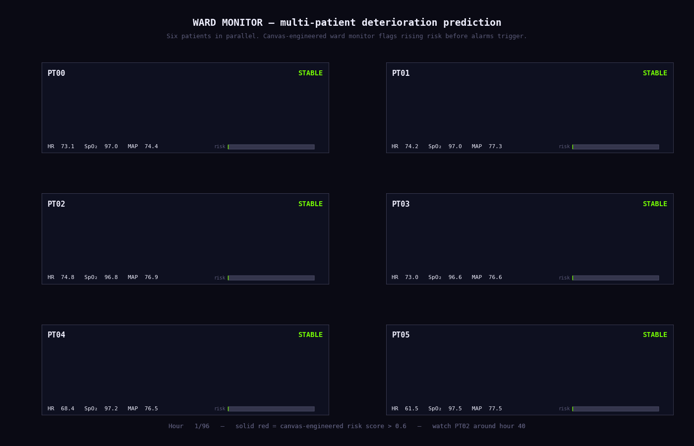 |

<!-- WHY: the ICU is the flagship for a reason — medicine makes "declared causal
     pathway" viscerally legible to non-robotics readers. The ward-monitor gif was cut
     from the paper (too dashboard-y for an academic figure) but it's perfect for X:
     it looks alive. -->

---

## 6/

> my favorite property: the latent tensor becomes POINTABLE. you can circle a run of blocks and say "that's nurses[1]." interpretability not as post-hoc attribution but as a legend for memory, known before training starts
>
> it's a type system for latent computation, literally: region bounds are struct offsets, the topology is a calling convention, a serialized schema is an ABI. two models sharing a schema can exchange latent state directly. no tokenization, no re-encoding

**images (4):**

| 1. "this is patients[2]" / "this is nurses[1]" annotations | 2. C struct ↔ canvas schema |
|---|---|
|  |  |
| **3. the serialized schema ("the ABI")** | **4. semantic-type embedding space** |
| 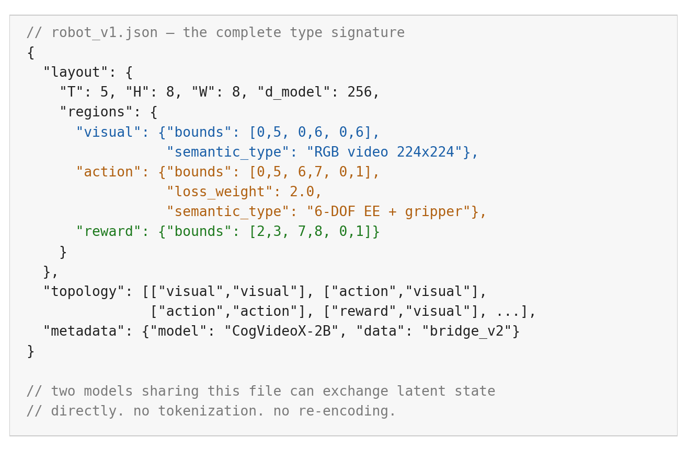 | 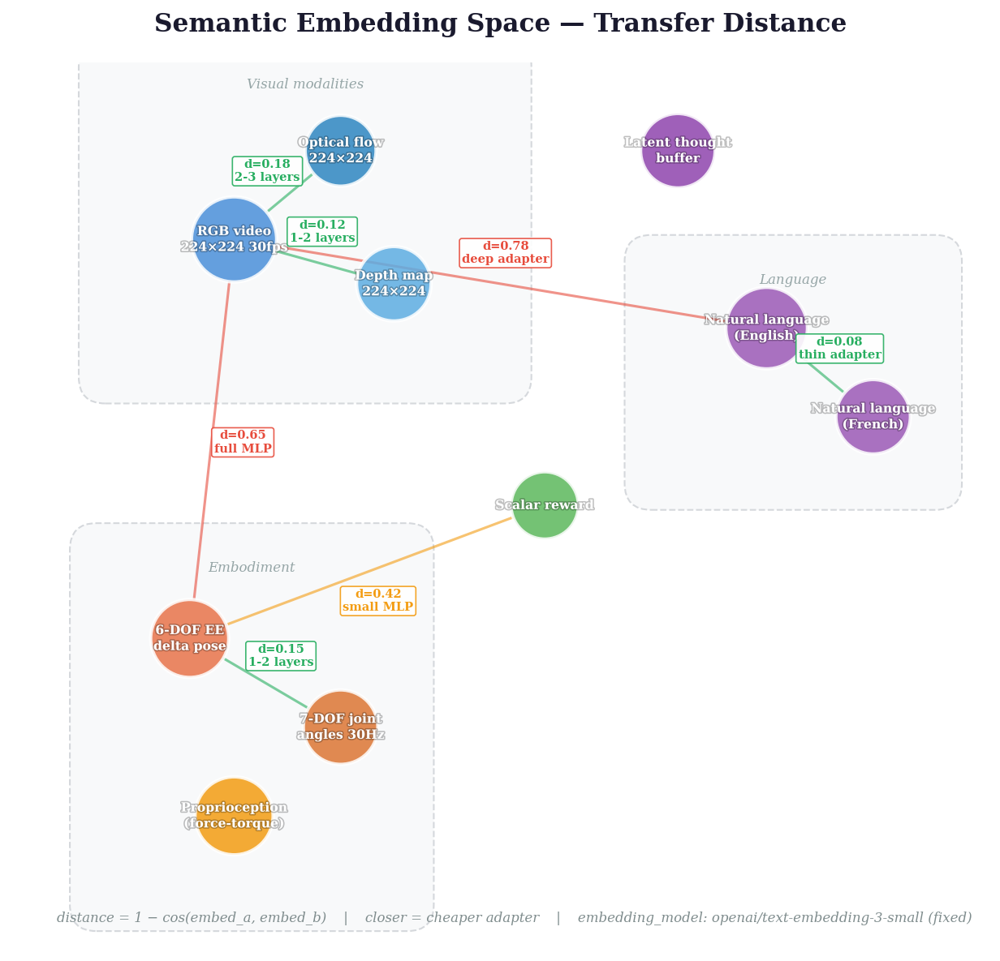 |

<!-- WHY: user called the pointability annotations "banger" — this post is built around
     that reaction. ICU figure repeats from 5/ deliberately: 5/ frames it as compiler
     output, 6/ reframes the SAME image as interpretability. Same pixels, new meaning —
     that's a feature, it rewards people reading the whole thread. -->
<!-- transfer_distance carries an implicit caveat (depends on representation stability,
     an open hypothesis) — the paper says so; the tweet doesn't have room. Acceptable
     for a thread; don't let this image travel alone without that caveat. -->

---

## 7/

> receipts so far (26 experiments, 236 training runs on CogVideoX-2B + Bridge V2): looped attention gives 1.73x parameter efficiency (p<0.001), and a frozen 350K-param config beats 11.7M unfrozen params on action prediction
>
> and to be upfront about what the data does NOT yet show at this scale: no measurable iterative reasoning from looping (it's weight-sharing regularization), and just co-locating modalities on a flat canvas doesn't buy binding — structure has to be declared, not hoped for. which is kind of the whole point

**images (2):**

| 1. Table 2 crop (loops × freeze grid) | 2. looped attention block diagram |
|---|---|
| 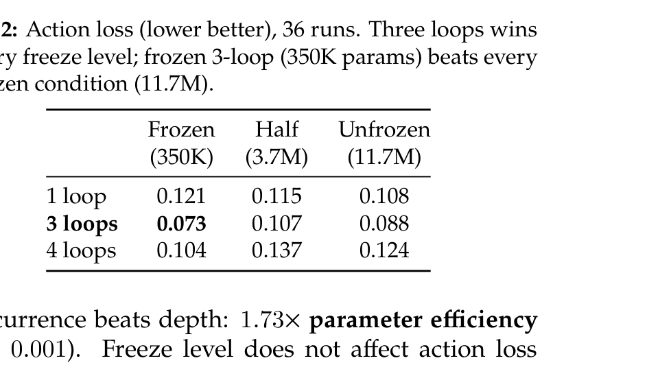 | 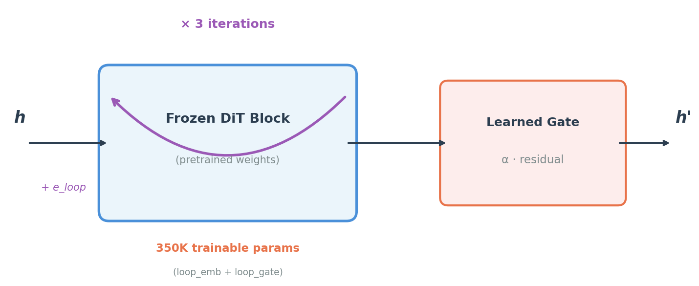 |

<!-- WHY the negative results stay in: pre-empting the "did you test whether it's just
     regularization?" reply is worth more than a cleaner-looking post. The judo move
     ("which is kind of the whole point") converts the null into the thesis — mirrors
     the reframe we did in the paper §5. If engagement data later shows this post kills
     the thread, the fallback is to merge the caveat sentence into post 9. -->

---

## 8/

> everything is open:
>
> 📄 paper: [LINK — add when hosted]
> 🧑‍💻 code: github.com/commandAGI/canvas-engineering
> 📚 docs + runnable examples (cartpole, vehicle fleets, air traffic control, a 23-region cortical model that predicts real brain dynamics at R²=0.825): commandagi.github.io/canvas-engineering
> 📦 pip install canvas-engineering
>
> apache 2.0, published under @commandagi

**images (4):**

| 1. cartpole | 2. minecraft world model |
|---|---|
| 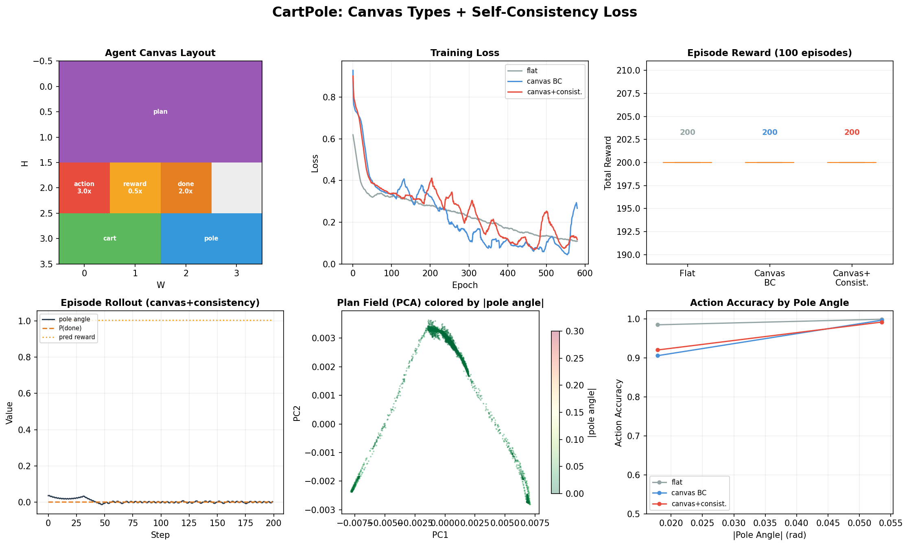 | 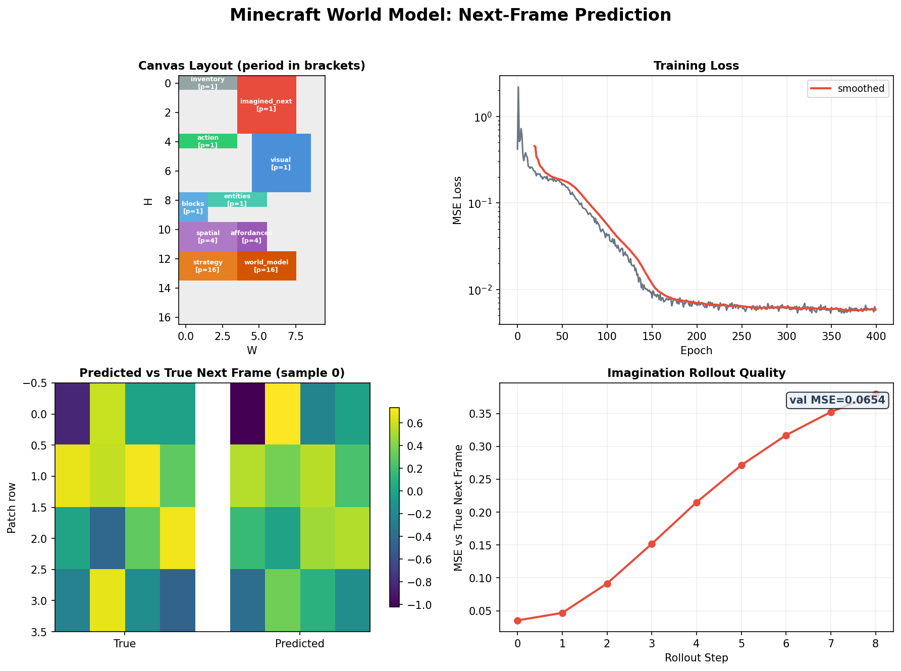 |
| **3. BCI + TRIBE** | **4. paper first page again** |
| 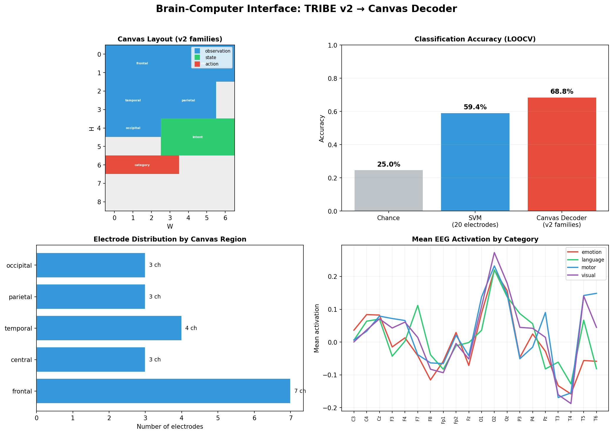 |  |

<!-- WHY: the links post doubles as an examples gallery — breadth (control, world models,
     BCI) signals "this is a library, not a demo." page1 repeats so the paper is attached
     at both ends of the thread for people who enter mid-thread. -->
<!-- TODO before posting: paper link; confirm @commandagi is the real X handle;
     consider a PyPI badge screenshot if the package page looks good by then. -->

---

## 9/

> and tbh sorry for "introducing" this like it's brand new. i actually built it jan–mar and perpetually held back bc "it's not ready yet" lol. it's still early and there's real open problems (representation stability is the linchpin — it's all specified and awaiting compute). but it introduces ideas i'm not seeing in the july 2026 discourse, so here it is. would rather run the experiments in public than polish in private. enjoy!

**images (1):** bookend with the spinning canvas

<!-- WHY: kept nearly verbatim from the user's draft — the self-deprecating confession
     is the most authentically-them sentence in the thread and X rewards that register.
     Ending on the same gif as post 1 is a bookend; also the last post is what shows in
     "show more replies" so it should carry an image. -->
<!-- "would rather run the experiments in public than polish in private" replaces the
     paper's more formal "we would rather run them than speculate ahead of them" —
     same sentiment, thread voice. -->

---

## posting checklist

- [ ] fill paper link in 8/
- [ ] verify @commandagi handle exists on X
- [x] GIFs under X's 15MB limit (canvas_rotating 5.4MB, icu_ward_monitor 3.2MB, vehicle_fleet 0.8MB)
- [ ] post 1 must be a QUOTE of the fchollet tweet, not a reply
- [ ] alt text: each image list above doubles as alt-text draft
