# canvas engineering launch thread

Quote-tweet of: https://x.com/fchollet/status/2072779641639875048
All images live in `paper/thread_assets/`. Regenerate with `python3 paper/make_thread_assets.py` (and `make_paper_figures.py` for the paper figures they copy).

<!-- WHY THIS STRUCTURE (10 posts): 1 hooks with the neurosymbolic framing + names the
     thing; 2-3 explain the mechanism (the load-bearing claim is in 3); 4 grounds in a
     known baseline (diffusion policy); 5-6 are the compiler + "every edge is a causal
     choice" payoff (the most shareable material); 7 is the brain existence-proof (the
     emotional/visionary peak — connectome=topology, plasticity=weights, backed by a real
     R²=0.825 experiment); 8 is receipts + honest limits; 9 links; 10 the confession.
     Front-load mechanism before results because this audience (fchollet QT readers) cares
     about the idea's shape more than the numbers. The brain post sits at 7, not 1, because
     the connectivity-matrix-is-an-attention-mask point only lands after the mask idea. -->

---

## 1/

> these neurosymbolic architectures are so beautiful and promising bc they let you declare transparent symbolic macro-structure directly inside learnable neural mechanics. no discrete/continuous boundary to cross. but they need to move out of research and into prod if they're ever going to be more tempting than just paying for more data. so today im finally
>
> introducing canvas engineering: prompt engineering, but for reverse diffusion latent space dynamics
>
> 🧵

**images (4):**

| 1. paper first page | 2. rotating (T,H,W) volume |
|---|---|
|  |  |
| **3. struct layout ↔ canvas schema** | **4. ICU compiler output (teaser for post 5)** |
|  |  |

<!-- WHY: user asked for page1 + rotating gif here. Added type-system and ICU as slots
     3-4 because post 1 gets ~10x the impressions of any other post — put the two most
     "wait, what?" images where the most eyes are, even if they're explained later.
     The gif autoplays in timelines = scroll-stopper. -->
<!-- "no discrete/continuous boundary to cross" added vs the original draft — it's the
     sharpest differentiator from the program-synthesis route Chollet describes, and it
     makes the QT a *response* rather than an announcement. -->

---

## 2/

> here's how it works: you declare the latent block regions on the canvas, their connectivity, their temporal update frequencies, and their loss roles. a compiler lowers all of that into attention masks, loss weights, and frame mappings on a stock pretrained diffusion transformer
>
> but instead of uniform reverse diffusion over a flat bag of tokens, the connectivity you declared means only specific blocks are even *allowed* to influence each other (attention, not conv). that hard constraint induces a causal graph inside the reverse diffusion dynamics — an interaction graph you define explicitly

**images (3):**

| 1. declarations → compiled canvas + overlaid connection arrows | 2. the five time slices of the same layout | 3. the topology compiled to an attention mask |
|---|---|---|
|  |  |  |

<!-- WHY: this is the "how it works" post so it carries the pipeline in pictures:
     code -> canvas -> compiled mask. code_to_canvas goes first because it fuses the
     declaration and the artifact in one image (user's request; clearest single
     explainer we have). -->
<!-- DROPPED fig_topology.png (the five constructors) here — per the user it's more a
     note on useful construction primitives than part of the core "how it works" story,
     and it diluted the pipeline. It stays as Figure 2 in the paper. -->
<!-- attention_mask is now the honest two-panel version: region-structure grid (with
     true block shapes + the visual/action asymmetry) plus the real mask on a broken
     axis that admits the 164 skipped visual positions. -->

---

## 3/

> the split is clean: you fix *whether* an edge exists, its direction, its temporal extent. gradients (data or intrinsic losses) determine *what flows* along it and everything inside regions
>
> macro is symbolic. micro is neural. and there's no interface between them, because the symbolic layer literally IS the attention mask. if there's no path between two regions, their independence is exact — by construction, not regularization. it's d-separation compiled into a denoiser

**images (1):** the four core equations

<!-- WHY only one image: this post is the thesis tweet, the one most likely to get
     screenshotted/quoted on its own. One austere math card underneath the boldest
     claim reads as "receipts attached"; a gallery here would dilute it. -->
<!-- "d-separation compiled into a denoiser" is the phrase to protect through edits —
     it compresses the whole paper for the ML-literate reader. -->

---

## 4/

> simplest possible example: diffusion policy. observation → action is just the two-node canvas. multi-agent perceptual diffusion — each agent self-attending over its own obs and actions, coordinating only through declared cross-edges — is the same primitive composed

**images (2):**

| 1. diffusion policy = the two-node canvas, across frames | 2. multi-agent = the same primitive composed |
|---|---|
| 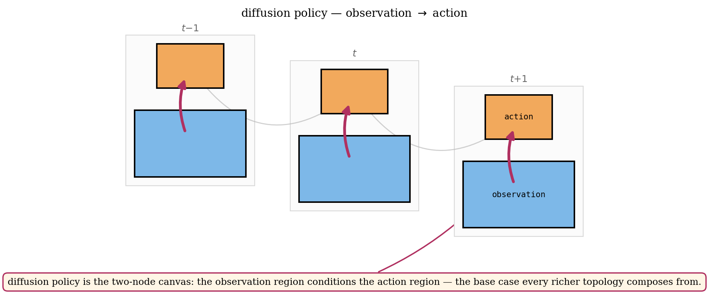 | 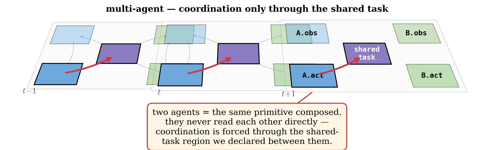 |

<!-- WHY: anchor-to-known-thing post. Diffusion policy is the reference point most of
     this audience already trusts; showing it as the degenerate 2-node case makes the
     general framework feel inevitable rather than exotic. -->
<!-- REPLACED the old repo demo art (vehicle_fleet.gif, air_traffic.png) and the generic
     node-graph fig_topology.png — they showed pretty rollouts but taught nothing about
     the mechanism. The two custom stagger-canvas diagrams show the ACTUAL structure:
     region blocks across frames, obs→action within a frame, coordination forced through
     a shared-task region. Same visual language as the ICU edge diagrams in post 6, so
     the thread reads as one system. -->

---

## 5/

> and you don't place rectangles by hand. you write the causal structure as a typed schema — the SAME structure that lives in the real world lives in the canvas. a robot's observation→action is a vision cone and a motion out in the field, and an obs→action edge on the canvas. you declare it once; the compiler flattens the graph into regions and attention masks
>
> and it scales: this is a full hospital ICU ward — 6 patients with organ-level physiology, 4 nurses with fatigue dynamics, insurance/staffing pressure, families. one compile_schema() call → 199 regions, 1,077 connections, auto-packed. heart_rate updates every frame, creatinine every 24. the sepsis pathway (renal → cardiovascular → neuro → deterioration_risk) is *declared*, not hoped for

**images (2):**

| 1. real ↔ neural: 4 robots in a field, the CanvasLayout+CanvasTopology, and the canvas the compiler builds | 2. schema → the causal graph it denotes → 199 packed ICU regions |
|---|---|
| 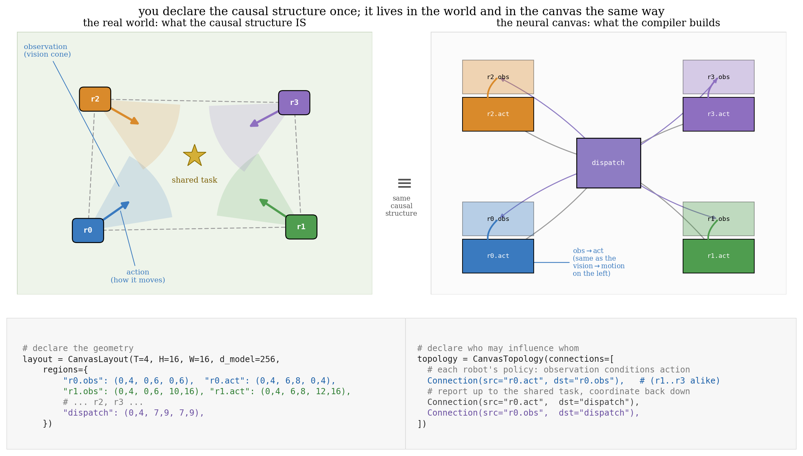 |  |

<!-- WHY image 1 (real_vs_neural, user request): the strongest single argument for the
     whole approach is that the causal structure in the physical world (robot sees →
     robot acts, coordinate through a shared task) and the neural structure on the canvas
     (obs region → act region, route through dispatch) are the SAME graph — and you wrote
     it. Showing the world scene, the CanvasLayout/CanvasTopology code, and the compiled
     canvas together makes "declared causal structure" concrete instead of abstract. -->
<!-- WHY image 2: the ICU is the flagship — medicine makes "declared causal pathway"
     viscerally legible, and it shows the same idea holds at 199 regions, not just 4.
     Order is concept-then-scale: robots teach the correspondence, ICU shows it doesn't
     fall over. -->
<!-- DROPPED the ward-monitor gif — it was eye-candy that showed a dashboard, not the
     canvas idea; it competed with the allocation figure for attention and pulled the
     post off-message. The "what the edges mean" story now lives in post 6 with the
     stagger diagrams, which is a stronger use of that slot. -->
<!-- NOTE: fig_icu_allocation is now a THREE-panel pipeline — schema (compositional
     pydantic) -> the causal graph it denotes (with the declared sepsis pathway
     highlighted) -> the auto-packed canvas. The middle panel renders the "compiler
     flattens the graph your schema represents" step that was [needs work] in the draft. -->

---

## 6/

> and every edge is a decision you can read back. these are three views of ONE declared ward connectivity, each highlighting a different link — nurse→patient across frames, state→risk, state persisting over time — with the causal reason it exists. you're not reverse-engineering what the model learned; you wrote the graph
>
> that's the deeper property: the latent tensor is POINTABLE. region bounds are struct offsets, the topology is a calling convention, a serialized schema is an ABI. two models sharing a schema can exchange latent state directly — no tokenization, no re-encoding

**images (4):**

| 1. nurse → patient (across frames): a nurse's actions change patient physiology next step | 2. state → risk: risk may only read from real physiological state |
|---|---|
| 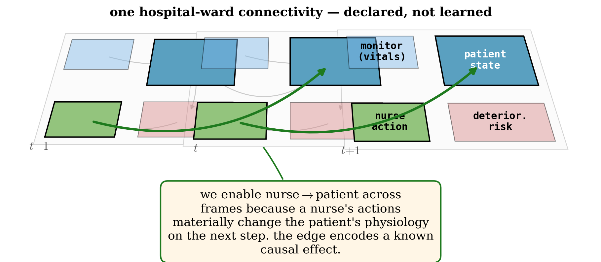 | 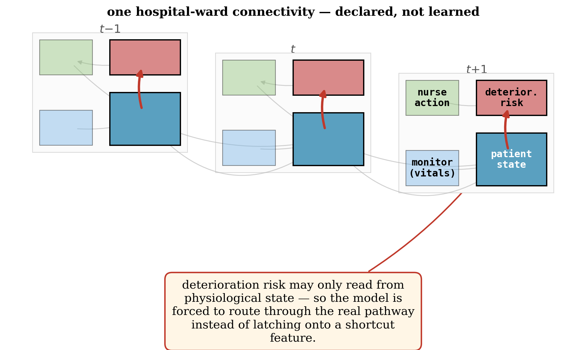 |
| **3. state(t-1) → state(t): physiology is continuous, so persistence is wired in** | **4. the serialized schema ("the ABI")** |
| 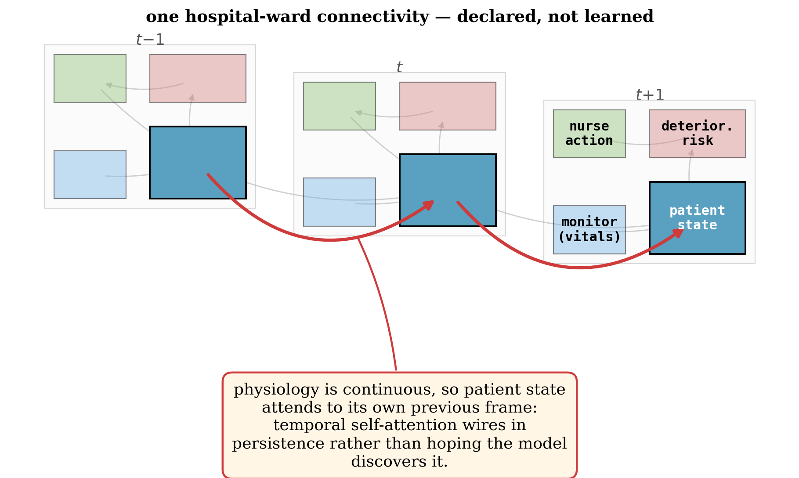 |  |

<!-- WHY: user wanted (a) NOT to reuse fig_icu_allocation from post 5, and (b) multiple
     annotated interactions on the same connectivity. Images 1-3 are exactly that: one
     mini-ICU connectivity, drawn three times, each highlighting a different declared
     edge with the causal reason it exists (custom stagger-canvas diagrams, same visual
     language as post 4). Image 4 (schema_json) carries the type-system/ABI point with a
     fresh non-ICU visual. -->
<!-- DROPPED transfer_distance here — it depends on the representation-stability
     hypothesis (still open in the paper), so it shouldn't travel in a punchy claims post
     without that caveat. Parked; could reappear in a follow-up thread about interop. -->
<!-- The pointability annotations ("this is nurses[1]") the user loved now live in post 5's
     allocation figure; this post carries the complementary "every edge is a legible
     causal choice" angle so 5 and 6 no longer share an image. -->

---

## 7/

> here's the part that made me build this in the first place: the cortex already works this way. its macro-wiring — which region talks to which — is largely specified by the connectome, fixed. the micro-weights are learned by synaptic plasticity over a lifetime. fixed topology + learned weights. that's the exact split canvas engineering makes
>
> and the cortical connectivity matrix from post 2? it's the SAME object as a canvas attention mask — source × destination, block-diagonal within a network, sparse specific cross-network edges, every cell an operator type. the connectome IS a canvas topology
>
> so we wired 23 Destrieux regions by 42 known cortical pathways (ventral visual stream, A1→Wernicke→Broca, prefrontal→premotor→motor, default-mode loop) and trained it on real TRIBE v2 cortical predictions. it hits R²=0.825 on next-timestep dynamics — matching a fully-dense model at 19.6% of the connections and 5× faster. topology is a convergence prior, not a capacity win (a dense net gets there too, just slower — exactly like the connectome accelerates development without setting the ceiling). a canvas EEG decoder also beats an SVM 69% vs 59%
>
> (and yeah — the shape is suggestive: cortex clamps sensory input and generates internally when the thalamic gate opens, which rhymes with clamp-context / denoise-future. i'm NOT claiming the cortex runs reverse diffusion. just that the structure rhymes, and now you can declare that structure on anything)

**images (4):**

| 1. you declare the connectome; SGD tunes the synapses | 2. the cortical connectivity matrix = a canvas attention mask |
|---|---|
| 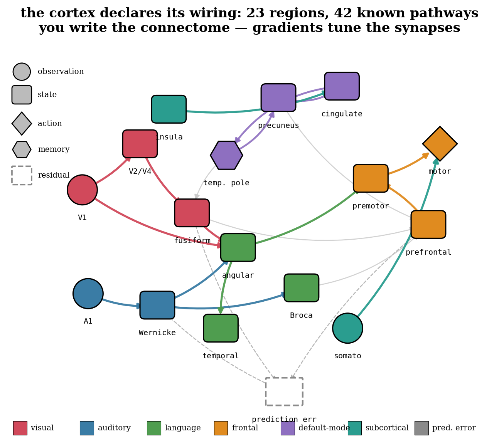 | 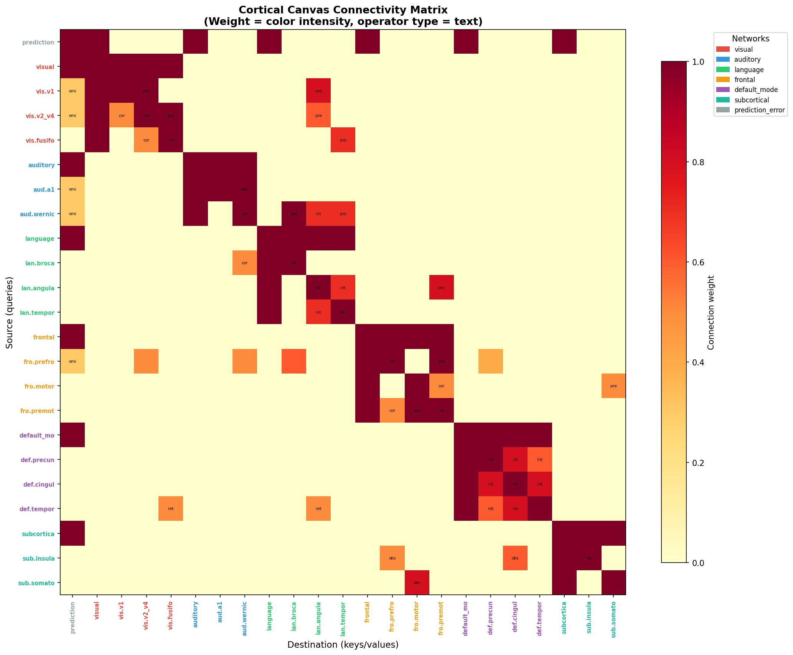 |
| **3. predicts real TRIBE v2 cortical dynamics — convergence prior, not capacity win** | **4. the canvas regions ARE cortical areas (on a real brain)** |
| 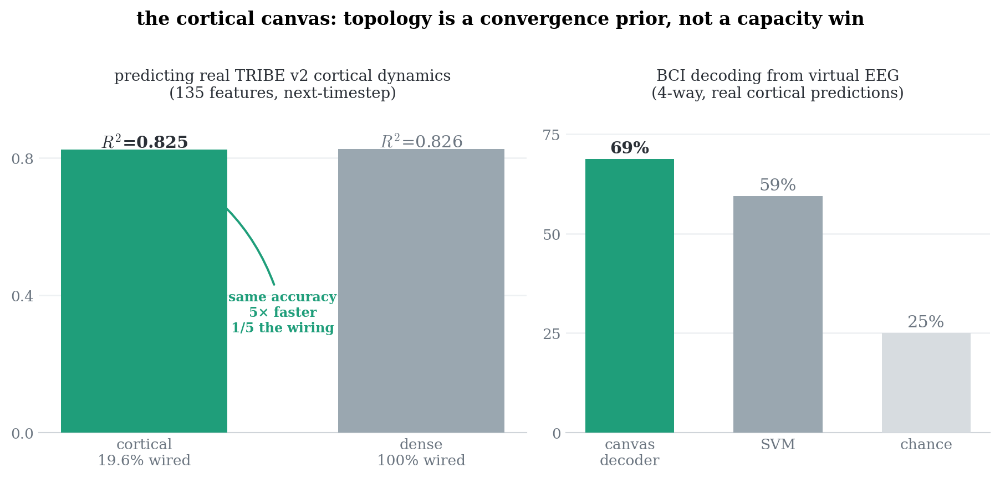 | 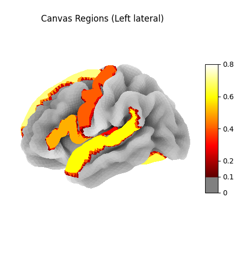 |

<!-- WHY this post exists (user's strongest under-used asset): the brain is the existence
     proof for "declared macro-topology + learned micro-weights," and it comes with a REAL
     experiment, which almost no brain-inspired pitch has. Placed here (not /1) deliberately:
     the connectivity-matrix-is-an-attention-mask point only lands AFTER the reader has seen
     the mask idea in post 2. -->
<!-- DISCIPLINE (per the pushback we agreed on): amplify the two things with evidence — the
     matrix=mask structural correspondence and R²=0.825-matching-dense-at-19.6% — and starve
     the one without. NO free-energy-principle-as-mechanism. The thalamocortical line is the
     ONE speculative sentence, explicitly flagged "i'm NOT claiming... just that it rhymes."
     Do not let anyone edit that hedge out. -->
<!-- HONESTY: the win is efficiency/convergence, NOT accuracy — a dense net matches it and a
     flat MLP beat it on the easy task. Numbers from research/brain/NOTES.md. If you overstate
     "brain topology wins," a critic opens the repo and quotes the flat-MLP line back. -->
<!-- Image 2 (connectivity_matrix.png) is the hero — same axes as attention_mask.png from
     post 2. If you want the pairing explicit, quote-embed post 2's mask beside it. -->

---

## 8/

> receipts so far (26 experiments, 236 training runs on CogVideoX-2B + Bridge V2): looped attention gives 1.73x parameter efficiency (p<0.001), and a frozen 350K-param config beats 11.7M unfrozen params on action prediction
>
> and to be upfront about what the data does NOT yet show at this scale: no measurable iterative reasoning from looping (it's weight-sharing regularization), and just co-locating modalities on a flat canvas doesn't buy binding — structure has to be declared, not hoped for. which is kind of the whole point

**images (1):** the walk-away receipt — recurrence beats scale

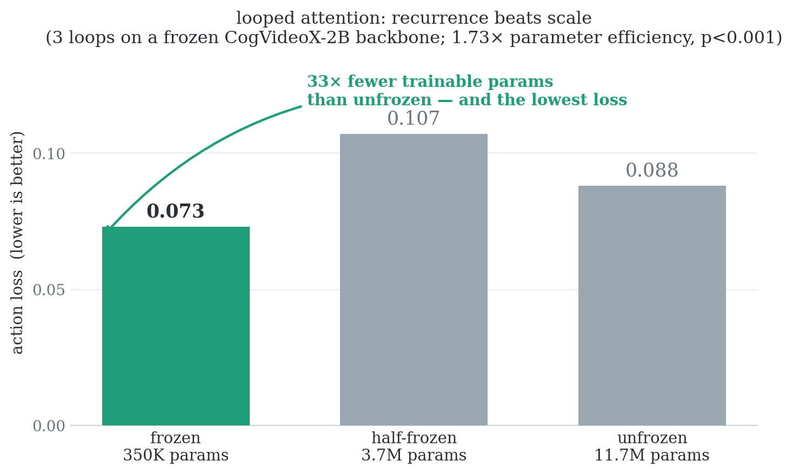

<!-- REPLACED the badly-cropped Table 2 screenshot AND the looped-attention block
     diagram (which communicated nothing) with one clean custom bar chart that carries
     the actual walk-away: a frozen 350K-param model has the LOWEST action loss — 33×
     fewer trainable params than the unfrozen 11.7M and still better. That's the receipt
     readers should leave with, not a raw grid. -->
<!-- WHY the negative results stay in the TEXT: pre-empting the "did you test whether it's
     just regularization?" reply is worth more than a cleaner-looking post. The judo move
     ("which is kind of the whole point") converts the null into the thesis — mirrors the
     reframe in the paper §5. -->
<!-- Chart built via the dataviz method: single series (action loss), one accessible hue
     with the winner highlighted, direct value labels, recessive grid/axis. -->

---

## 9/

> everything is open:
>
> 📄 paper: [LINK — add when hosted]
> 🧑‍💻 code: github.com/commandAGI/canvas-engineering
> 📚 docs + runnable examples (cartpole, vehicle fleets, air traffic control, a 23-region cortical model that predicts real brain dynamics at R²=0.825): commandagi.github.io/canvas-engineering
> 📦 pip install canvas-engineering
>
> apache 2.0, published under @commandagi

**images (2):**

| 1. cartpole control (real gym env) | 2. BCI decoding on real TRIBE cortical predictions |
|---|---|
|  |  |

<!-- WHY: the links post doubles as a small examples gallery — two distinct domains
     (control + neural decoding) signal "this is a library, not a one-trick demo." -->
<!-- DROPPED "paper first page again" (page1) — repeating the same hero at both ends of
     the thread is bad taste; the paper link in the text is enough. -->
<!-- DROPPED minecraft_world_model.png — a static frame of a world-model demo says nothing
     about the canvas. IDEA for a real replacement: an annotated video of the canvas
     "thinking" (its region activations) with the input feed overlaid, so you can watch
     the declared structure light up during rollout. We don't have that asset yet; it
     needs a running model. Parked as the strongest possible image for this slot. -->
<!-- NOTE: cartpole/bci_tribe are still repo demo art. Kept because they signal breadth
     and weren't flagged, but they're candidates to swap for custom diagrams later. -->
<!-- TODO before posting: paper link; confirm @commandagi is the real X handle. -->

---

## 10/

> and tbh sorry for "introducing" this like it's brand new. i actually built it jan–mar and perpetually held back bc "it's not ready yet" lol. it's still early and there's real open problems (representation stability is the linchpin — it's all specified and awaiting compute). but it introduces ideas i'm not seeing in the july 2026 discourse, so here it is. would rather run the experiments in public than polish in private. enjoy!

**images (1):** bookend with the spinning canvas

<!-- WHY: kept nearly verbatim from the user's draft — the self-deprecating confession
     is the most authentically-them sentence in the thread and X rewards that register.
     Ending on the same gif as post 1 is a bookend; also the last post is what shows in
     "show more replies" so it should carry an image. -->
<!-- "would rather run the experiments in public than polish in private" replaces the
     paper's more formal "we would rather run them than speculate ahead of them" —
     same sentiment, thread voice. -->

---

## posting checklist

- [ ] fill paper link in 9/ (the links post)
- [ ] verify @commandagi handle exists on X
- [x] GIFs under X's 15MB limit (canvas_rotating 4.0MB)
- [ ] post 1 must be a QUOTE of the fchollet tweet, not a reply
- [ ] post 7: keep the thalamocortical hedge intact ("i'm NOT claiming... just that it rhymes") — no FEP-as-mechanism
- [ ] post 7 image 2: consider quote-embedding post 2's attention_mask beside the connectivity matrix to make "same object" explicit
- [ ] alt text: each image list above doubles as alt-text draft
